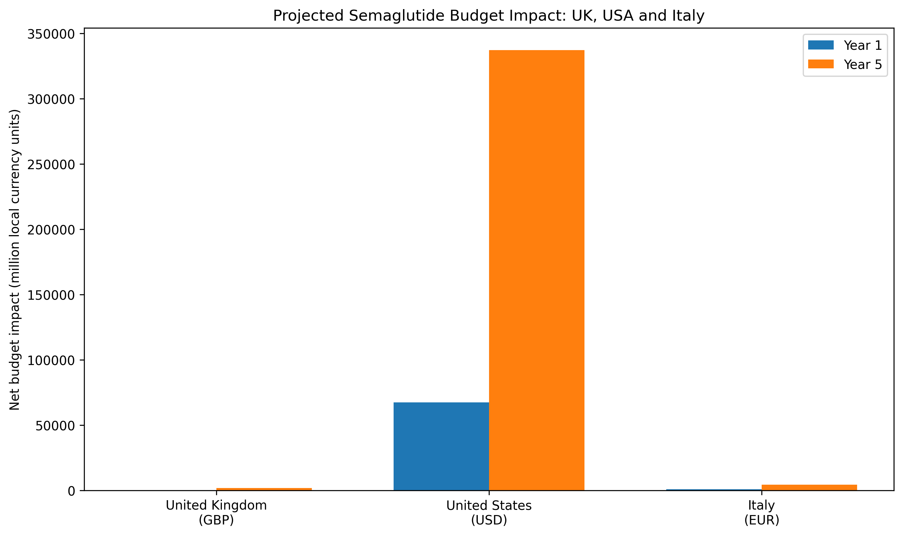
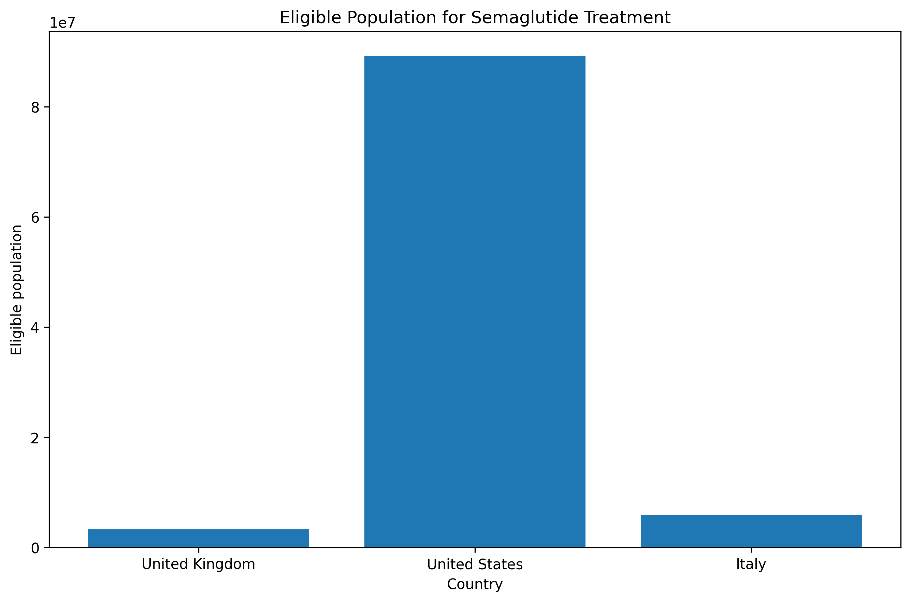
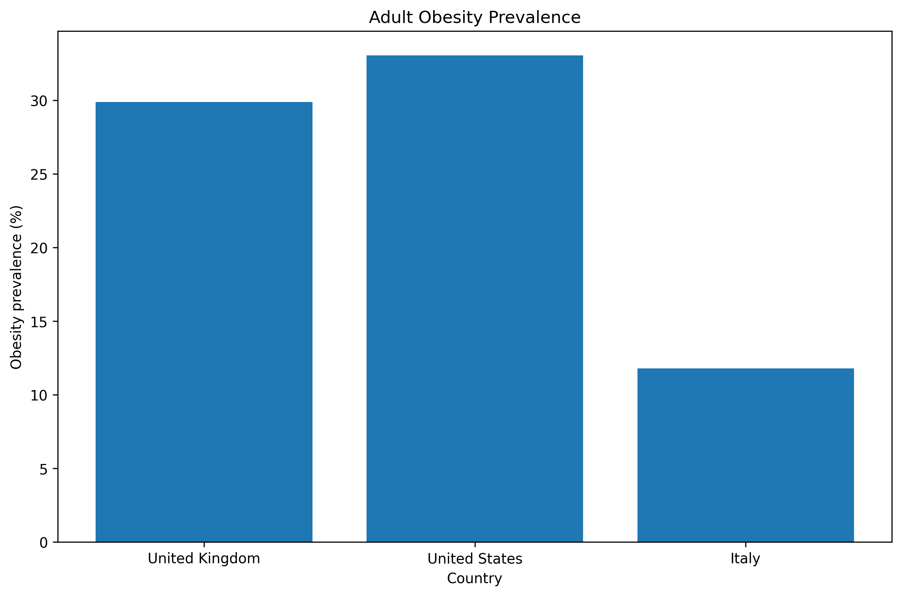

# Semaglutide Budget Impact Models

Comparative budget impact analyses of semaglutide (Wegovy) for obesity management using publicly available healthcare data from the United Kingdom, United States, and Italy, with Europe planned as a future extension.

---

# Project Overview

This repository develops transparent and reproducible Budget Impact Models (BIMs) to estimate the potential financial impact of introducing semaglutide-based obesity treatment across different healthcare systems.

The project applies Health Economics and Outcomes Research (HEOR) methods to evaluate:

* Adult and eligible patient populations
* Treatment uptake scenarios
* Annual medication costs
* Healthcare cost offsets where country-specific evidence is available
* Five-year net budget impact
* Sensitivity of results to key model assumptions

All analyses use publicly available datasets and published evidence. Calculations are designed to be traceable and reproducible.

---

# Data Sources

The models use publicly available population, epidemiological, healthcare, and pharmaceutical data.

Detailed country-specific source documentation is available below:

* [United Kingdom sources](references/uk_sources.md)
* [United States sources](references/usa_sources.md)
* [Italy sources](references/italy_sources.md)

The Europe model is planned as a future extension of the project.

---

# Methods

Each country-specific Budget Impact Model follows a consistent analytical framework while allowing country-specific population, epidemiological, treatment-cost, and healthcare-cost assumptions.

The analysis includes:

* Population estimation
* Obesity prevalence estimation
* Eligible treatment population calculation
* Treatment uptake scenarios
* Semaglutide treatment cost estimation
* Healthcare cost offset estimation where appropriate
* Five-year net budget impact projection
* Sensitivity analysis of key model parameters

## Tools

* Python
* Pandas
* NumPy
* Matplotlib
* Jupyter Notebook
* Visual Studio / VS Code

All calculations are based on publicly available healthcare data and documented assumptions.

---

# Results

## United Kingdom 🇬🇧

The UK budget impact model estimates the potential financial impact of introducing semaglutide treatment among eligible adults with obesity.

| Metric                   |         Result |
| ------------------------ | -------------: |
| Adult population (18+)   |   55.0 million |
| Obesity prevalence       |          29.9% |
| Eligible population      |   3.29 million |
| Annual treatment cost    |         £2,500 |
| Year 1 net budget impact | £394.9 million |
| Year 5 net budget impact |  £1.97 billion |

### Model Outputs

* [UK model summary](reports/uk/uk_model_summary.csv)
* [UK budget impact table](reports/uk/tables/uk_budget_impact_summary.csv)
* [UK budget impact figure](reports/uk/figures/uk_budget_impact.png)
* [UK price sensitivity figure](reports/uk/figures/uk_price_sensitivity.png)

### UK Budget Impact Projection


---

## United States 🇺🇸

The US budget impact model evaluates the potential payer impact of semaglutide (Wegovy) adoption among adults with obesity.

The model incorporates:

* US adult population estimates
* Obesity prevalence estimates
* Semaglutide treatment costs
* Healthcare cost offsets
* Five-year treatment uptake scenarios
* Sensitivity analysis

| Metric                   |              Result |
| ------------------------ | ------------------: |
| Adult population (18+)   |       269.8 million |
| Obesity prevalence       |               33.1% |
| Adults with obesity      |        89.2 million |
| Annual treatment cost    | $17,537 per patient |
| Year 1 net budget impact |       $67.5 billion |
| Year 5 net budget impact |      $337.3 billion |

### Model Outputs

* [USA model summary](reports/usa/tables/usa_model_summary.csv)
* [USA population summary](reports/usa/tables/usa_population_summary.csv)
* [USA adult population summary](reports/usa/tables/usa_adult_population_summary.csv)
* [USA eligibility summary](reports/usa/tables/usa_eligibility_summary.csv)
* [USA epidemiology summary](reports/usa/tables/usa_epidemiology_summary.csv)
* [USA drug cost summary](reports/usa/tables/usa_drug_cost_summary.csv)
* [USA healthcare cost parameter](reports/usa/tables/usa_healthcare_cost_parameter.csv)
* [USA semaglutide cost-offset summary](reports/usa/tables/usa_semaglutide_cost_offset_summary.csv)
* [USA budget impact summary](reports/usa/tables/usa_budget_impact_summary.csv)

### USA Visual Outputs

#### Treated Population Growth


#### Treatment Cost vs Healthcare Savings


#### Five-Year Net Budget Impact


#### USA Model Summary Dashboard


---

## Italy 🇮🇹

The Italy budget impact model estimates the potential five-year financial impact of semaglutide treatment among adults with obesity.

The model incorporates:

* Italian adult population estimates
* Adult obesity prevalence
* Eligible population estimates
* Five-year treatment uptake scenarios
* Annual semaglutide treatment costs
* Sensitivity analysis of treatment cost and uptake

| Metric                    |          Italy |
| ------------------------- | -------------: |
| Adult population (18+)    |   50.3 million |
| Obesity prevalence        |          11.8% |
| Eligible population       |  ~5.94 million |
| Annual treatment cost     |         €3,000 |
| Year 1 uptake             |             5% |
| Year 1 treated population |       ~297,000 |
| Year 1 net budget impact  |  ~€891 million |
| Year 5 uptake             |            25% |
| Year 5 treated population |  ~1.48 million |
| Year 5 net budget impact  | ~€4.45 billion |

No Italy-specific healthcare cost offset is applied in the current base-case model because a suitable country-specific published estimate has not been incorporated.

The Italy results should therefore be interpreted as a **treatment-cost impact scenario** rather than a current Italian National Health Service reimbursement budget impact.

### Model Outputs

* [Italy model summary](reports/italy/tables/italy_model_summary.csv)
* [Italy adult population summary](reports/italy/tables/italy_adult_population_summary.csv)
* [Italy budget impact summary](reports/italy/tables/italy_budget_impact_summary.csv)
* [Italy drug cost sensitivity](reports/italy/sensitivity/italy_drug_cost_sensitivity.csv)
* [Italy uptake sensitivity](reports/italy/sensitivity/italy_uptake_sensitivity.csv)

### Italy Visual Outputs

#### Budget Impact


#### Drug Cost Sensitivity


#### Uptake Sensitivity


---

# Cross-Country Comparison

The project compares the United Kingdom, United States, and Italy using a consistent budget impact modelling framework.

The comparison considers:

* Adult population size
* Adult obesity prevalence
* Eligible treatment population
* Annual treatment cost
* Treatment uptake
* Year 1 budget impact
* Year 5 budget impact

Because treatment costs and budget impacts are reported in each country's local currency, monetary values are **not directly converted or ranked across currencies**. The comparison is intended to show how differences in population size, obesity prevalence, treatment costs, and modelling assumptions contribute to country-specific budget impact estimates.

### Cross-Country Budget Impact



### Eligible Population Comparison



### Adult Obesity Prevalence Comparison



### Cross-Country Model Outputs

* [Cross-country budget impact comparison](reports/comparative/country_budget_impact_comparison.csv)
* [Cross-country model summary](reports/comparative/country_model_summary.csv)
* [UK reports](reports/uk/)
* [USA reports](reports/usa/)
* [Italy reports](reports/italy/)

The Europe model is planned as a future extension.

---

# Research Question

**What would be the potential healthcare budget impact of introducing semaglutide for obesity management across different healthcare systems?**

The analysis examines how population size, obesity prevalence, treatment costs, uptake scenarios, and healthcare-cost assumptions influence the potential financial impact of adoption.

---

# Project Objectives

* Build country-specific Budget Impact Models
* Estimate eligible populations for obesity treatment
* Compare potential healthcare-system impacts across countries
* Apply HEOR modelling principles
* Conduct sensitivity analyses for key assumptions
* Demonstrate reproducible healthcare analytics using Python
* Create an open-source healthcare economics portfolio project

---

# Countries Included

| Country             | Status    |
| ------------------- | --------- |
| 🇬🇧 United Kingdom | Completed |
| 🇺🇸 United States  | Completed |
| 🇮🇹 Italy          | Completed |
| 🇪🇺 Europe         | Planned   |

---

# Modelling Approach

Each country model follows a consistent budget impact framework:

1. Estimate the adult population
2. Apply obesity prevalence estimates
3. Define the eligible treatment population
4. Apply treatment uptake scenarios
5. Estimate annual treatment costs
6. Estimate healthcare cost offsets where supported by country-specific evidence
7. Calculate net budget impact
8. Conduct sensitivity analyses

The same core framework is applied across country models while allowing country-specific data, costs, reimbursement context, and assumptions.

---

# Limitations

This analysis represents a budget impact scenario model and does not predict actual future expenditure.

Important limitations include:

* Treatment uptake assumptions represent hypothetical scenarios rather than observed future utilization
* Drug prices may vary by payer, reimbursement arrangement, discounts, and negotiated agreements
* Healthcare cost offsets depend on the availability and applicability of published evidence
* Country-specific healthcare systems and reimbursement rules may affect the real-world budget impact
* Country models use publicly available aggregate data rather than individual patient-level data
* Some model parameters require assumptions where suitable country-specific evidence is unavailable
* Monetary results across countries are reported in local currencies and should not be interpreted as directly comparable financial magnitudes without currency conversion and purchasing-power considerations
* The Italy base case does not include an Italy-specific healthcare cost offset
* The Italy treatment-cost parameter is a modelling assumption and should not be interpreted as a current Italian NHS reimbursement tariff

The purpose of this project is to demonstrate transparent HEOR modelling methods and compare potential financial impacts across healthcare systems using reproducible public data.

---

# Project Structure

```text
semaglutide-budget-impact-models/
│
├── data/
│   ├── uk/
│   ├── usa/
│   ├── italy/
│   └── europe/
│
├── notebooks/
│   ├── 01_project_planning.ipynb
│   ├── 02_uk_nice_review.ipynb
│   ├── 03_population_analysis.ipynb
│   ├── 04_budget_impact_model.ipynb
│   ├── 05_country_comparison.ipynb
│   ├── 06_sensitivity_analysis.ipynb
│   ├── italy_budget_impact_model.ipynb
│   └── usa_visualisations.ipynb
│
├── references/
│   ├── uk/
│   ├── usa/
│   ├── italy/
│   └── data_sources.md
│
├── reports/
│   ├── uk/
│   ├── usa/
│   ├── italy/
│   └── comparative/
│
├── src/
│
├── README.md
└── requirements.txt
```

---

# Project Status

| Component                          | Status      |
| ---------------------------------- | ----------- |
| UK Budget Impact Model             | Completed   |
| USA Budget Impact Model            | Completed   |
| Italy Budget Impact Model          | Completed   |
| Country-level sensitivity analyses | Completed   |
| USA visualisations                 | Completed   |
| Cross-country comparison           | Completed   |
| Model output documentation         | Completed   |
| Europe model                       | Planned     |
| Final quality-control review       | In progress |

---

# Future Extension

The next planned geographic extension is a Europe-level analysis using harmonised publicly available data.

Potential future work includes:

* Europe-wide population and obesity estimates
* Country-level variation in treatment uptake
* Cross-country reimbursement differences
* Healthcare cost offsets
* Additional sensitivity and scenario analyses
* Comparative HEOR interpretation across healthcare systems
