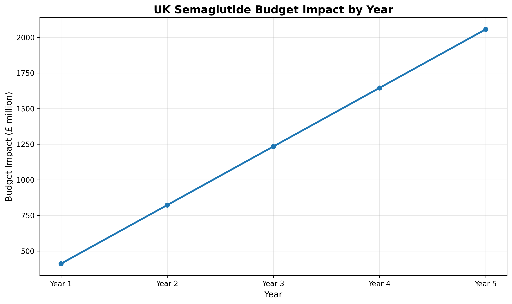
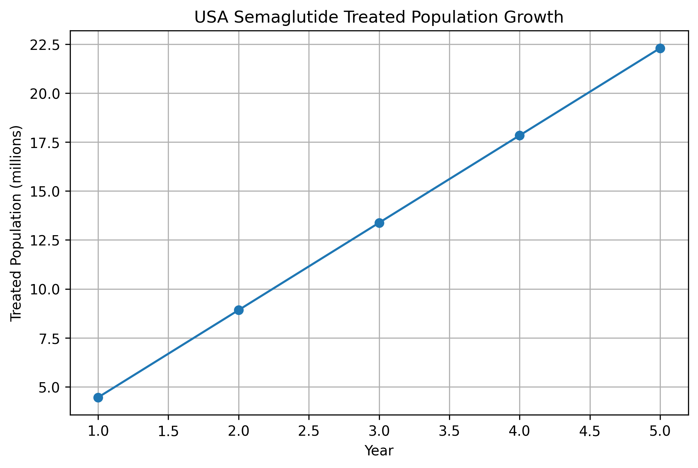
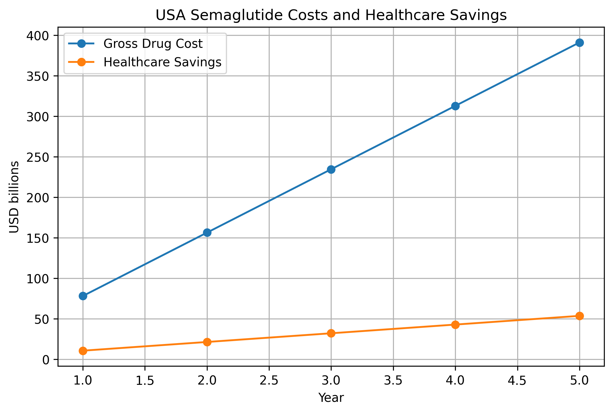
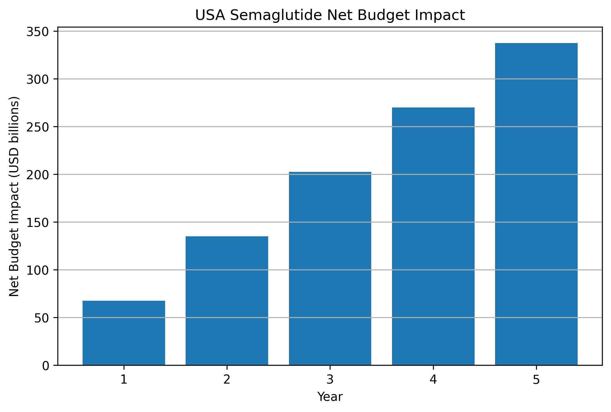
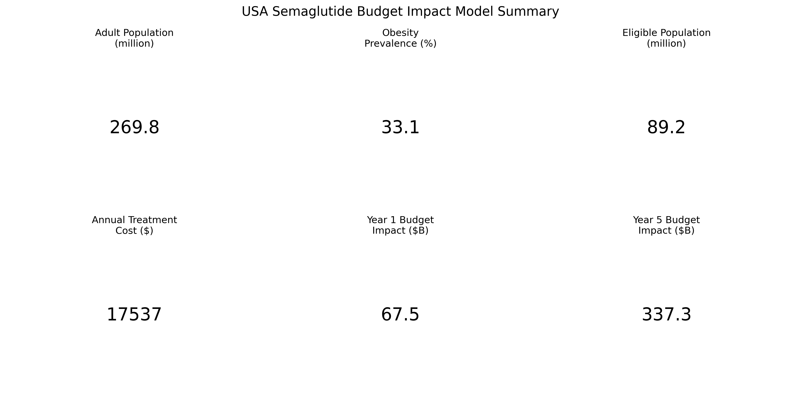
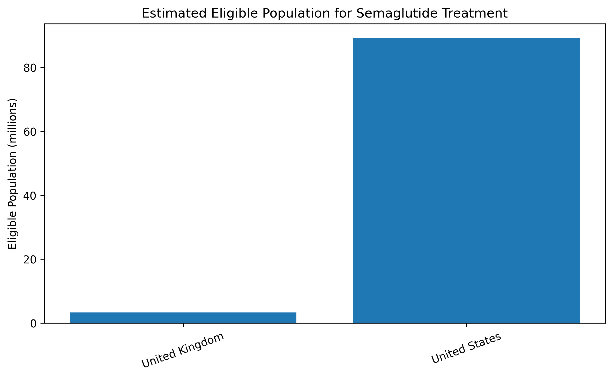
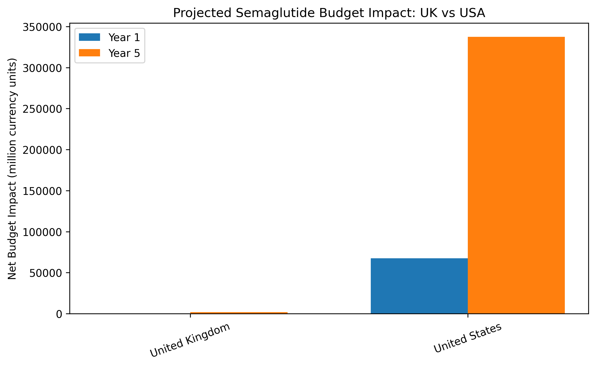

# Semaglutide Budget Impact Models

Comparative budget impact analyses of semaglutide (Wegovy) for obesity management using publicly available healthcare data from the United Kingdom, United States, Italy, and Europe.

---

# Project Overview

This repository develops transparent and reproducible Budget Impact Models (BIMs) to estimate the financial impact of introducing semaglutide-based obesity treatment across different healthcare systems.

The project applies Health Economics and Outcomes Research (HEOR) methods to evaluate:

- Eligible patient populations
- Treatment uptake scenarios
- Annual medication costs
- Healthcare cost offsets
- Overall budget impact on healthcare systems

All analyses use publicly available datasets and published evidence. Every calculation is designed to be traceable and reproducible.

## Data Sources

Detailed documentation:

- [UK Data Sources](references/uk_sources.md)
- [USA Data Sources](references/usa_sources.md)

# Methods

Budget impact models were developed using a transparent, reproducible approach.

The analysis includes:

- Population estimation
- Obesity prevalence estimation
- Eligible treatment population calculation
- Semaglutide treatment cost estimation
- Treatment uptake scenarios
- Healthcare cost offset estimation
- Five-year budget impact projection

Tools used:

- Python
- Pandas
- NumPy
- Matplotlib
- Jupyter Notebook

All calculations are based on publicly available healthcare data sources.

# Results

## United Kingdom 🇬🇧

The UK budget impact model estimates the potential financial impact of semaglutide treatment among eligible adults with obesity.

Key model outputs:

| Metric | Result |
|---|---:|
| Adult population (18+) | 55.0 million |
| Obesity prevalence | 29.9% |
| Eligible population | 3.29 million |
| Annual treatment cost | £2,500 |
| Year 1 budget impact | £394.9 million |
| Year 5 budget impact | £1.97 billion |

### UK Budget Impact Projection




---

## United States 🇺🇸

The USA budget impact model evaluates the potential payer impact of semaglutide adoption using publicly available population, obesity, healthcare cost and treatment cost data.

Key model outputs:

| Metric | Result |
|---|---:|
| Adult population (18+) | 269.8 million |
| Obesity prevalence | 33.1% |
| Eligible population | 89.2 million |
| Annual treatment cost | $17,537 |
| Year 1 budget impact | $67.5 billion |
| Year 5 budget impact | $337.3 billion |


### USA Treated Population Growth




### USA Drug Cost vs Healthcare Savings




### USA Net Budget Impact




### USA Model Summary Dashboard


## United Kingdom

The UK model estimates the financial impact of introducing semaglutide among eligible adults with obesity.

## United States

The US model estimates a substantially larger gross budget impact due to higher drug acquisition costs and population size.

## Cross-country comparison

The project compares how healthcare system structure, obesity prevalence, treatment eligibility and drug pricing influence budget impact.

---

# Research Question

**What would be the potential healthcare budget impact of introducing semaglutide for obesity management across different healthcare systems?**

The project compares how population size, obesity prevalence, treatment costs, and healthcare structures influence the financial impact of adoption.

---

# Project Objectives

- Build country-specific budget impact models
- Estimate eligible populations for obesity treatment
- Compare healthcare system impacts across countries
- Apply HEOR modelling principles
- Demonstrate reproducible healthcare analytics using Python
- Create an open-source healthcare economics portfolio project

---

# Countries Included

| Country | Status |
|----------|--------|
| 🇬🇧 United Kingdom | ✅ Completed |
| 🇺🇸 United States | ✅ Completed |
| 🇮🇹 Italy | 🔄 Planned |
| 🇪🇺 Europe | 🔄 Planned |

---

# Modelling Approach

Each country model follows a similar framework:

1. Estimate adult population
2. Apply obesity prevalence estimates
3. Define eligible treatment population
4. Apply treatment uptake scenarios
5. Estimate annual treatment costs
6. Estimate healthcare cost offsets
7. Calculate net budget impact

---

# Current Results
---

# Visualisations

## Eligible Treatment Population Comparison



## Five-Year Budget Impact Comparison



## 🇬🇧 United Kingdom

| Metric | Value |
|--------|------:|
| Adult population | 55.0 million |
| Obesity prevalence | 29.9% |
| Eligible population | 3.29 million |
| Year 1 net budget impact | £394.9 million |
| Year 5 net budget impact | £1.97 billion |

## 🇺🇸 United States

| Metric | Value |
|--------|------:|
| Adult population | 269.8 million |
| Obesity prevalence | 33.1% |
| Adults with obesity | 89.2 million |
| Annual treatment cost | $17,537 per patient |
| Year 1 net budget impact | $67.5 billion |
| Year 5 net budget impact | $337.3 billion |

## General model structure:

```
Net Budget Impact = Drug Costs − Healthcare Cost Offsets
```

The same framework is applied across all country models while allowing country-specific assumptions, costs, and epidemiological data.